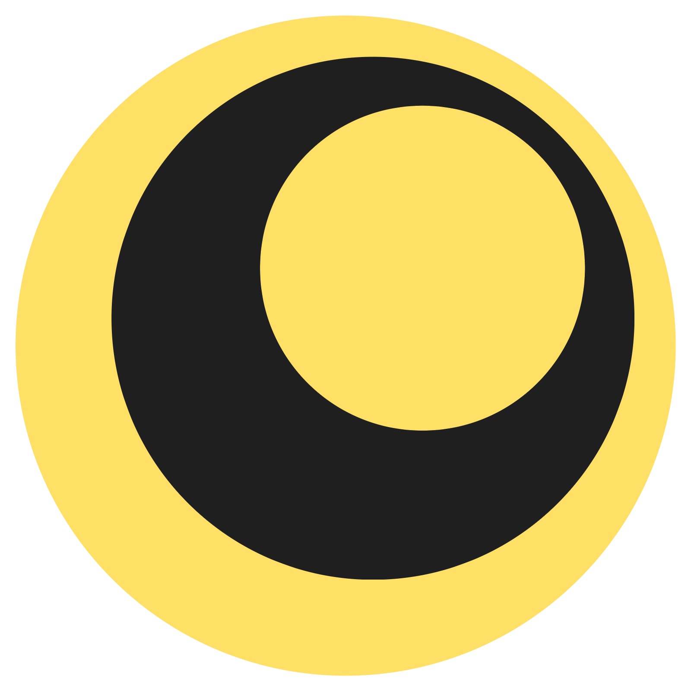
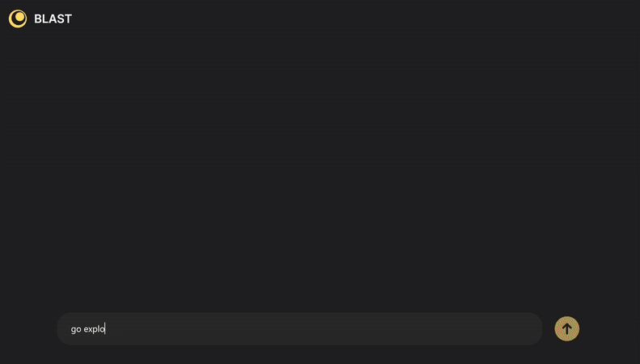

<div align="center">
  
</div>

<p align="center" style="font-size: 24px">A high-performance serving engine for web browsing AI.</p>

<div align="center">

[](https://blastproject.org)
[](https://docs.blastproject.org)
[](https://discord.gg/NqrkJwYYh4)
[](https://x.com/realcalebwin)

</div>

<div align="center">
  
</div>

## Use Cases

1. **I want to add web browsing AI to my app...** BLAST serves web browsing AI with an OpenAI-compatible API and concurrency and streaming baked in.
2. **I need to automate workflows...** BLAST will automatically cache and parallelize to keep costs down and enable interactive-level latencies.
3. **Just want to use this locally...** BLAST makes sure you stay under budget and not hog your computer's memory.

## Quick Start

```bash
pip install blastai && blastai serve
```

```python
from openai import OpenAI

client = OpenAI(
    api_key="not-needed",
    base_url="http://127.0.0.1:8000"
)

# Stream real-time browser actions
stream = client.responses.create(
    model="not-needed",
    input="Compare fried chicken reviews for top 10 fast food restaurants",
    stream=True
)

for event in stream:
    if event.type == "response.output_text.delta":
        print(event.delta if " " in event.delta else "<screenshot>", end="", flush=True)
```

## Features

- **OpenAI-Compatible API** Drop-in replacement for OpenAI's API
- **High Performance** Automatic parallelism and prefix caching
- **Streaming** Stream browser-augmented LLM output to users
- **Concurrency** Out-of-the-box support many users with efficient resource management

## Documentation

Visit [documentation](https://docs.blastproject.org) to learn more.

## Contributing

Awesome! See our [Contributing Guide](https://docs.blastproject.org/development/contributing) for details.

## MIT License

As it should be!
